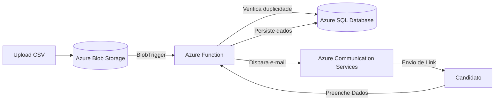

# ☁️ Cloud Onboarding: Automação de Documentos Admissionais em Nuvem

> **Bootcamp Computação em Nuvem (UNISAGRADO)** | Projeto em parceria com o RH da **Concilig**

---

## 📋 Sobre o Projeto

Sistema *serverless* e *event-driven* desenvolvido na **Microsoft Azure** para automatizar o envio de solicitações e a coleta de documentos admissionais do RH da Concilig.

### 🔴 O Problema
Envio manual e individual de e-mails para novos colaboradores, gerando gargalos, erros de digitação e retrabalho em períodos de contratação em massa.

### 🟢 A Solução
O RH faz o upload de uma planilha `.csv` no **Azure Blob Storage**, acionando automaticamente uma **Azure Function**. O sistema valida duplicidades no **Azure SQL Database**, envia e-mails com links via **Azure Communication Services** e armazena os dados preenchidos pelos candidatos.

---

## 🏗️ Arquitetura

## 🏫 Instituição e Orientação
Instituição de Ensino: UNISAGRADO (Bauru/SP)

Módulo/Disciplina: Bootcamp Computação em Nuvem

Professor Responsável: Prof. Henrique Martins

Instituição Atendida: RH da Concilig (Representante: Agnes Ferrari)

Período: Agosto a Setembro de 2026
